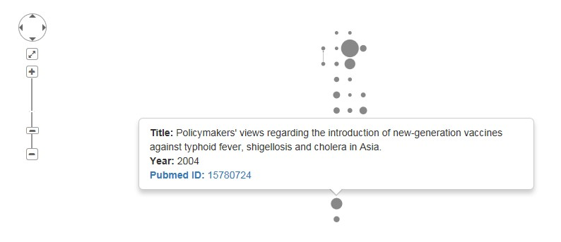

# What is JournalVis?

JournalVis is a full text search tool that allows for searching and trending by topic or 
concept instead of by keyword. JournalVis can help you find the right document or describe trends in the whole collection of documents by topic or concept instead of by keyword. It is currenltly 

# What documents can JournalVis access?

JournalVis currently has live access to a number of online databases, including:
* pubmed - Medical journal database with full access to all abstracts and metadata using integrated search feature
* aRxiv - Preprint database with full access to all abstracts and metadata using integrated search feature
* PLOS - Open access journal collection with full access to all abstracts and metadata using integrated search feature
* Local files - Any local collection of documents on your PC. Supported formats include .pdf, .doc, .docx, and .txt
* CSV files - Any .csv formatted file with unique IDs in one column and document text in another column

# Using JournalVis

JournalVis can be used to perform a number of document visualization, filtering, modeling, and searching tasks. It currently has the following primary capabilities:

## Document visualization and filtering

JournalVis creates a visual network diagram of your article collection so you can easily determine hich documents are most referenced or influential, what the dependency tree of documents is, and when the documents were published. This visualization tool also supports highlighting and filtering by up to two separate article metadata properties. To use this tool, navigate to the "Article Network" tab and select the yes radio button under "Generate Article Graph". This will display the article network, which shows the articles arranged by year on the vertical axis, sized by number of citations, and linked by references. The network can be rescaled as appropriate by using the sliders at the top of the page. This article network can be used to browse articles as follows:

* Explore the document network and document contents by hovering your cursor over a document node to display title, year, and author details. Click on the document node to display the abstract. The Document ID is a hyperlink that will open a new browser window or tab that displays the entire document on the database’s website:

* Select groups of keywords and article types in the summary bar graphs at the bottom of the page to color the document nodes based on those attributes. The filter buttons found above the bar graphs allow you to filter the article results to include or exclude the highlighted articles from the article set being analyzed:

## Topic model exploration

JournalVis can also help you understand the overall concepts and trends in your document collection through the use of a structural topic model. A topic model is a statistical model that attempts to construct a set of topics that describe the documents being analyzed. For example, a group of documents about cars may have a topic about fuel efficiency and a topic about comfort. For this type of model, each document may be made up of more than one topic. In the example above, a review of a car will be likely to contain both the topic about comfort and the topic about fuel efficiency. The topic model will appropriately identify complex relationships like these. The information created by the topic model can be explored in several different ways:

### Full text concept search

JournalVis can search for documents using the concepts and topics pulled from a full search sentence, paragraph, or document. In this mode, you can enter a full paragraph or more of text data that you would like to use to search. 
JournalVis will then digest the data and extract the topics or concepts. It will return a ranked list of search results starting with the closest matching document. In contrast to a keyword search, JournalVis will naturally understand 
synonyms and acronyms in your search (e.g. it will understand that 'car' and 'automobile' mean the same thing). In contrast to a keyword search, the more text or data you provide, the better the search results as long as the search text is about the same topic you are trying to find.

The results presented in the table give the percent match (from 0 to 100), the title of the document (which is 
hyperlinked to the source document in the associated database where possible), and a preview of the full text of the document in the FullText column.

These ranked results can be further filtered by keyword or keywords by entering the keyword or key phrase into the 
"Search" box at the top right of the table of results. 

### Topic trending over time

JournalVis can also give you a high level understanding of the topic trends in the documents in your database without you needing to read each document. In this mode, JournalVis will display trends over time for any keyword, key-phrase, or combination of keywords. As an example, you might be interested in trending 'privacy' over time as it relates to articles about the internet to see how there are many more concerns about privacy lately than in the 1990s or 2000s.    

To plot a keyword or keyphrase, simply enter the term into the search field and then press the "Plot Search Phrase" button to see the trend over time. To visualize another trend at the same time, simply enter another phrase in the search box and press the "Plot Search Phrase" button again. The "Clear Phrase Plot" button will clear all plots. All multi-word search terms separated by spaces will try to match the entire phrase (e.g. "Social Media" will only return topics with this exact term). The joint trend of two phrases at a time (e.g. "Social Media" and "Privacy") can be plotted by separating each term with a comma as follows: "Social Media, Privacy".

### Topic mapping and model exploration

JournalVis can also display a representation of the topics in your document collection and how they are related to one another. In this mode, the topics from the statistical model are projected onto a 2d map in such a way that two topics close to one another on the map are more likely to be related than two topics that are far away from one another. The size of each topic bubble relates to how often the topic is represented in the document collection:

To examine the topics, use the arrows to cycle through each topic to see the relevant words for that topic on the right hand side of the page. When a topic is selected, it will turn red and the probability list on the right will change to represent the word probabilities for that topic in red with the overall word probabilities of the entire document set in blue for comparison:

If you hover the mouse over a word in the word probability list, the topic circles will be resized to reflect the likelihood of that word appearing in each topic. In the example below, the cursor is hovering over the word “mice”, causing the topic map to enlarge topics 4, 6, and 7 to reflect the fact that those topics have a high likelihood of containing that word. The other topics (not pictured) have shrunk down to be nearly invisible since they are very unlikely to contain the word “mice”.

The topic model also accounts for the fact that probabilities change over time. To see how a topic changes over time, select a topic by clicking on it with the mouse. The topic will be highlighted and a graph will be generated on the bottom of the page to reflect the change in overall probability over time. In the example below, topic 6 is much more likely to appear in documents created after 2010 than in documents created before 2005:

If you would like to identify documents associated with specific topics of interest, click on the “Clear Topic Selections” button at the top of the page to clear all topic selections. Then click on the topic or topics that you want to use to filter the documents list. In the example below, topics 1 and 2 have been selected. All selected topics are displayed on the “Selected Topic Trend Over Time” graph on the bottom of the page:

Once the topics have been selected, navigate back to the document map by clicking on the “Article Network” tab at the top of the page. The document map will now be filtered using the topics selected on the Topic Map. Documents that are very relevant to the selected topic(s) will be opaque. Documents that are not relevant will be translucent or invisible. Opacity is calculated on a variable scale such that the more opaque a document is, the more relevant it is. In the example below, we see the relevancy of documents based on the earlier selection of topics 1 and 2: Note that you can navigate back and forth between these two tabs at any time once a search has been completed:

## Building your own model (advanced users)

JournalVis can also be used to build a custom topic model from any supported document collection. To build a new model for exploration, follow the steps below:

1. Navigate to the "Article Network"" tab, select the "Advanced User" radio button on the sidebar, select your target database, and perform the article search as shown below.

2. Explore and filter the results as described in the "Document visualization and filtering" section of this user guide, above.

3. Once you have selected and filtered the search results, you can create a topic model of all remaining documents based on the filters you have selected by clicking on the "Create Topic Model" button on the sidebar. Once clicked, a topic model will be created. This may take some time so please be patient while the model is constructed.

4. Once the topic model is complete, you can explore the results of the analysis as described in the "Topic model exploration" section above.

5. You can save the results of a document search to a csv file to share by clicking on the "Save Article List" button on the sidebar.

6. You can also save the topic model created in step 3 by clicking on the "Save Model" button on the sidebar. This will save all document data and the topic model created in step 3.

7. You can easily load existing models by clicking on the "Browse" button under "Load Existing Model?". This will restore the document network and topic model from a previously saved model.

# Who can I contact for questions about JournalVis?

JournalVis is under active developmentt with new features under development on a bi-weekly schedule. You can find more information about current known issues, upcoming features, and new releases at the github project page:

https://github.com/taalbrecht/JournalVis

Questions, feature requests, and any other feedback is always appreciated!
